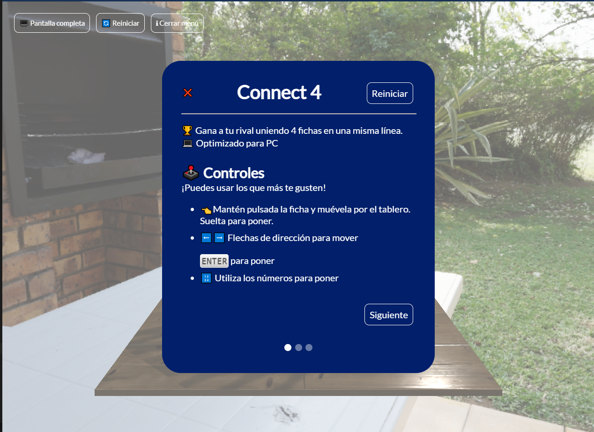
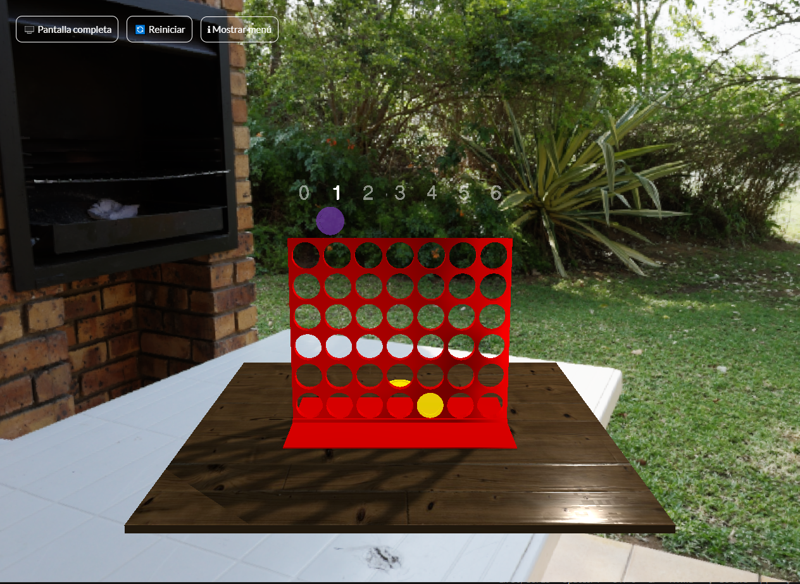
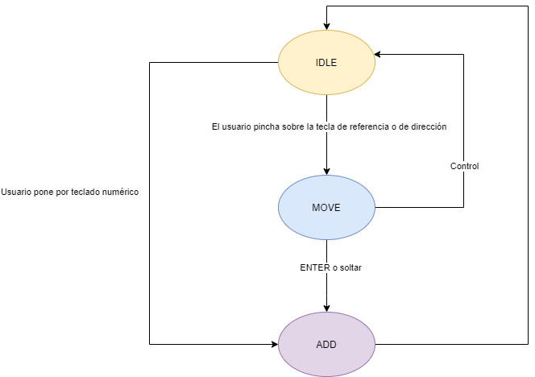
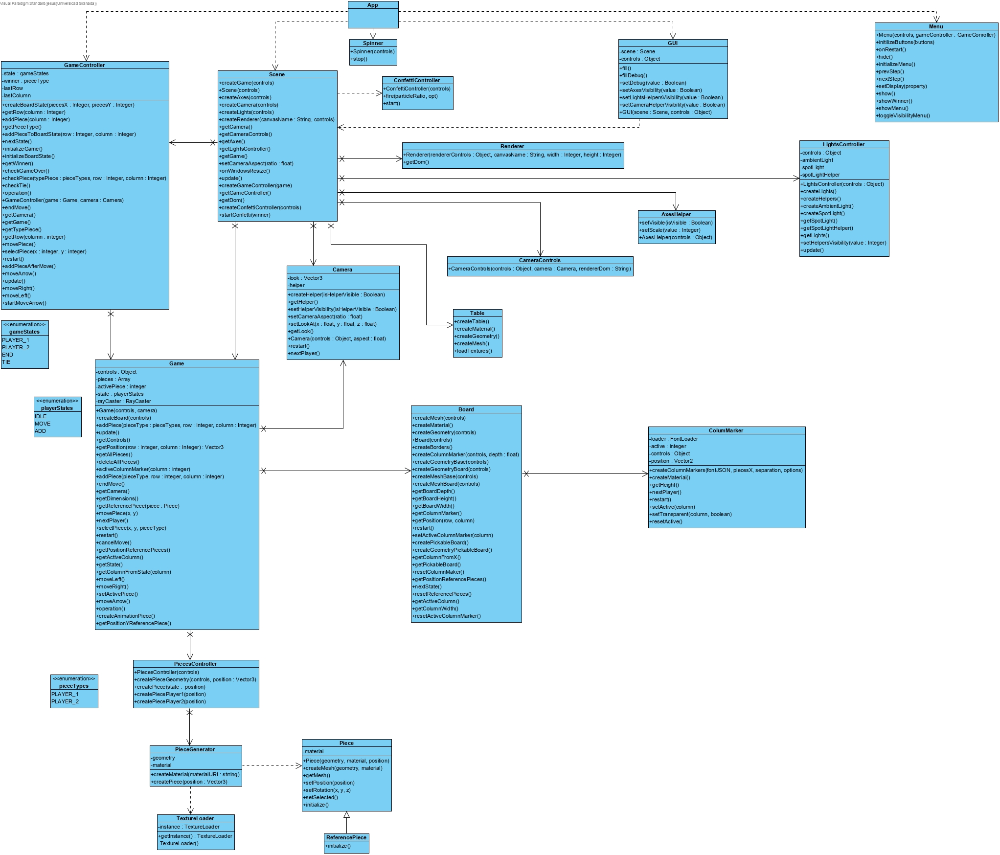

# Connect4

Proyecto realizado para la asignatura "Sistemas Gráficos" en la Universidad de Granada. Se trata de un juego 3D: el famoso cuatro en raya.
[Ver versión live](https://jesusgonzaleza.github.io/Connect4/)

## Instrucciones
Gana el jugador que conecte 4 piezas consecutivas de un mismo color, ya sea en horizontal, vertical o diagonal.

## Controles
Se puede interactuar de cualquiera de estas maneras:
- Utiliza los números del teclado para poner.
- Mueve una ficha con las teclas de dirección. Presiona ENTER para poner y CONTROL para cancelar.
- Mantén pulsada la ficha y muévela por el tablero. Suéltala para poner. Presiona CONTROL para cancelar el movimiento.

## Demo

## Documentación
### Estructura de carpetas
- **assets/:**: archivos complementarios a la aplicación. Encontramos fuentes, sonidos y texturas. 
- **doc/:**: documentación del proyecto. Se encuentran los diagramas y la demo.
- **src/:**: scripts que conforman el proyecto.
    - **components/:**: elementos principales del proyecto.
    - **helpers/:**: funciones de ayuda.
    - **App.js:** inicializa el proyecto.
    - **Scene.js:** crea la escena (vista).
    - **TextureLoader.js:** para cargar las texturas.
    - **controls.js:** modulo donde se define la configuración del proyecto. Definimos tamaños, posiciones, rotaciones, velocidades...
- **styles/:**: hojas de estilo para la aplicación.
- **vendor/:** bibliotecas externas.
- **index.html:** archivo que contiene el canvas donde se inicializa la escena.

### Diagramas
[Ver aquí](https://github.com/JesusGonzalezA/Connect4/blob/main/doc/StatesDiagram)

[Ver aquí](https://github.com/JesusGonzalezA/Connect4/blob/main/doc/ClassDiagram)

## Herramientas

### Bibliotecas 3D
- [ThreeJS](https://github.com/mrdoob/three.js)
- ThreeBSP

### Animaciones
- [TweenJS](https://github.com/tweenjs/tween.js/)
- [canvas-confetti](https://github.com/catdad/canvas-confetti#readme): para la animación de fin de partida. Puede ver cómo utilizarla [aquí](https://www.kirilv.com/canvas-confetti/) (referenciada con un cdn en el archivo html)
- [HDRI to CubeMap](https://matheowis.github.io/HDRI-to-CubeMap/)

## Referencias
### Fuentes
[Ir a directorio](https://github.com/JesusGonzalezA/Connect4/blob/main/assets/fonts)

Cogidas del repositorio de [ThreeJS](https://github.com/mrdoob/three.js)

### Sonidos
[Ir a directorio](https://github.com/JesusGonzalezA/Connect4/blob/main/assets/sounds)

Cogido de [freesound](https://freesound.org/people/deraj/sounds/202546/) 

### Texturas
[Ir a directorio](https://github.com/JesusGonzalezA/Connect4/blob/main/assets/textures)

- [Mapa de ambiente](https://hdrihaven.com/hdri/?h=veranda)
- [Tablero](https://github.com/nidorx/matcaps)
- [Pieza amarilla](https://market.pmnd.rs/material/plastic)
- [Pieza morada](https://github.com/nidorx/matcaps)
- [Mesa](https://market.pmnd.rs/material/wood-floor-43)

## Autores

* :bust_in_silhouette: Jesús González Álvarez     :octocat: [JesusGonzalezA](https://github.com/JesusGonzalezA)
 * :bust_in_silhouette: Alejandro Soriano Morante  :octocat: [Soriano00](https://github.com/Soriano00)